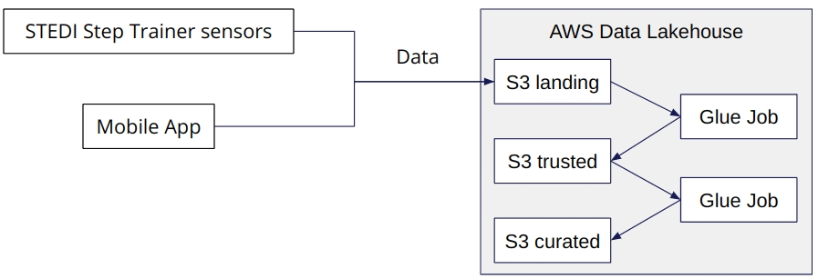
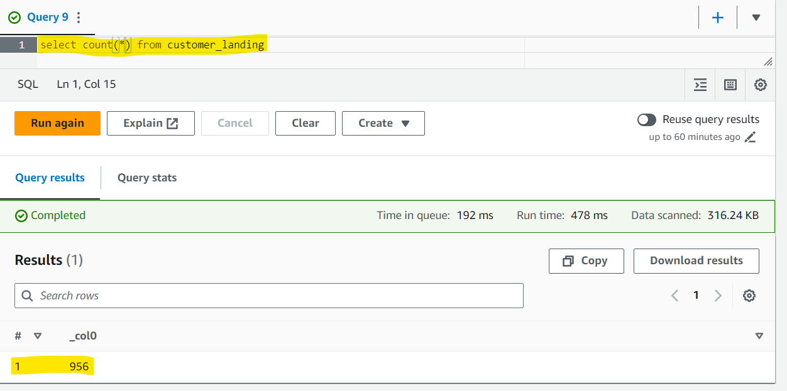
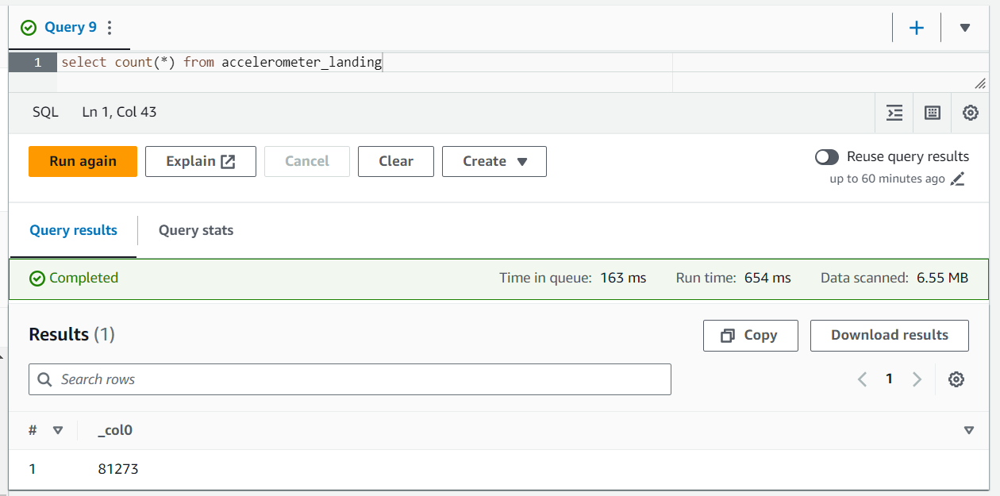
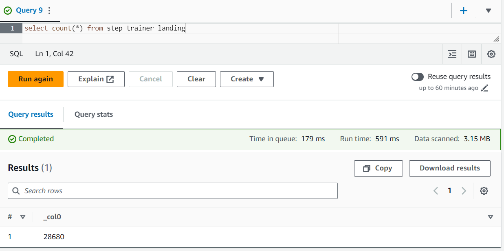
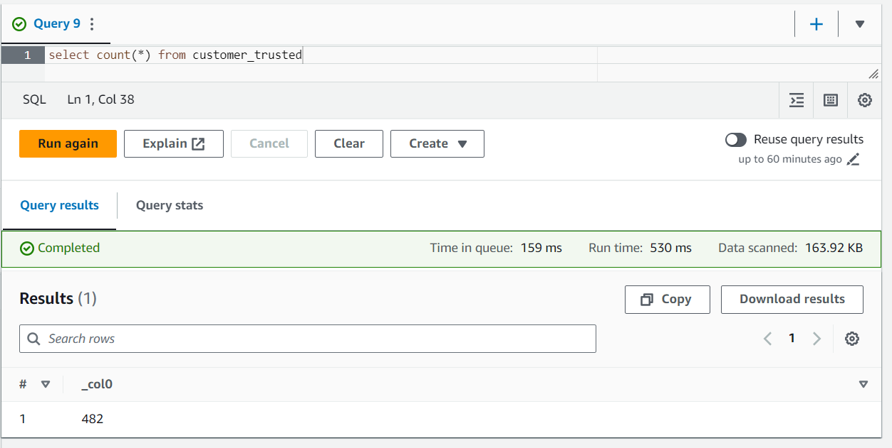
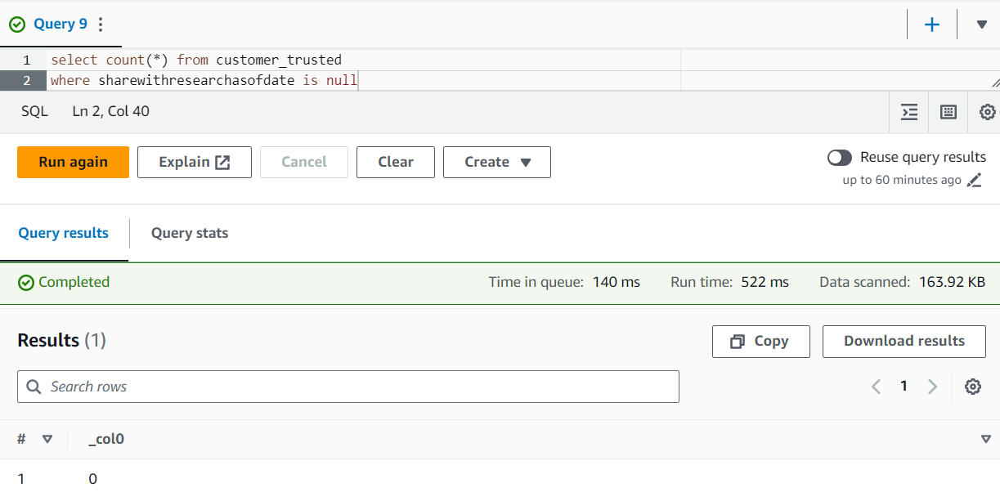

# Spark (Udacity Data Engineering Nanodegree Project `Spark and Data Lakes`)

## STEDI Human Balance Analytics
The STEDI Team has been developing a hardware STEDI Step Trainer that:

- Trains the user to do a STEDI balance exercise; and has sensors on the device that collect data to train a machine-learning algorithm to detect steps;
- Has a companion mobile app that collects customer data and interacts with the device sensors. 

The STEDI team wants to use the motion sensor data to train a machine learning model to detect steps accurately in real-time. 

**Privacy** will be a primary consideration in deciding what data can be used. Some of the early adopters have agreed to share their data for research purposes. **Only these customers’ Step Trainer and accelerometer data should be used in the training data for the machine learning model.**

## Project Objective
Build a data lakehouse solution for sensor data that trains a machine learning model: 
- Extract the data produced by the STEDI Step Trainer sensors and the mobile app, and 
- Curate the extracted data into a data lakehouse solution on AWS so that Data Scientists can train the learning model.

## Project Dataset
STEDI has three JSON data sources to use from the Step Trainer: 

- **customer**
[Data Download URL](https://github.com/udacity/nd027-Data-Engineering-Data-Lakes-AWS-Exercises/tree/main/project/starter/customer/landing)

Customer's records contain the following fields:

    serialnumber
    sharewithpublicasofdate
    birthday
    registrationdate
    sharewithresearchasofdate
    customername
    email
    lastupdatedate
    phone
    sharewithfriendsasofdate
Here's an example of one record:
```
{"customerName":"Santosh Clayton","email":"Santosh.Clayton@test.com","phone":8015551212,"birthDay":"1900-01-01","serialNumber":"50f7b4f3-7af5-4b07-a421-7b902c8d2b7c","registrationDate":1655564376361,"lastUpdateDate":1655564376361,"shareWithResearchAsOfDate":1655564376361.0,"shareWithPublicAsOfDate":1655564376361.0,"shareWithFriendsAsOfDate":1655564376361.0}

```
- **step_trainer**
[Data Download URL](https://github.com/udacity/nd027-Data-Engineering-Data-Lakes-AWS-Exercises/tree/main/project/starter/step_trainer/landing)

Step_trainer records contain the following fields:

    sensorReadingTime
    serialNumber
    distanceFromObject
Example:
```
{"sensorReadingTime":1655564444103,"serialNumber":"50f7b4f3-7af5-4b07-a421-7b902c8d2b7c","distanceFromObject":218}
```
- **accelerometer**
[Data Download URL](https://github.com/udacity/nd027-Data-Engineering-Data-Lakes-AWS-Exercises/tree/main/project/starter/accelerometer/landing)

accelerometer records contain the following fields:

    stimeStamp
    user
    x
    y
    z
Example:
```
{"user":"Santosh.Clayton@test.com","timestamp":1655564444103,"x":1.0,"y":-1.0,"z":-1.0}
```

## Process Description

### Configuring AWS Glue
Creating S3 VPC Gateway Endpoint. Parameters needed:
- VPC ID
- Route Table ID

Creating the Glue Service IAM Role. You will need:
- Create an AWS IAM roles that can assume Glue Services. 
- Allow the Glue job to read/write/delete access to the bucket and everything in it.
- Give Glue access to data in special S3 buckets used for Glue configuration, and several other resources.

### Work Flow


### Creating S3 directories for data sources

To simulate the data coming from the various sources, Create own S3 directories for customer_landing, step_trainer_landing, and accelerometer_landing zones, and copy the data there as a starting point.

### Landing zones
Including 3 AWS Glue Tables:
- `customer_landing`: contains all semi-structured data from `customer_landing` directory on S3

    -- Records count: 956

    -- [SQL Script](https://github.com/udacity/nd027-Data-Engineering-Data-Lakes-AWS-Exercises/tree/main/project/starter/accelerometer/landing)



- `accelerometer_landing`: contains all semi-structured data from `accelerometer_landing` directory on S3.

    -- Records count: 81273

    -- [SQL Script](https://github.com/udacity/nd027-Data-Engineering-Data-Lakes-AWS-Exercises/tree/main/project/starter/accelerometer/landing)



- `step_trainer_landing`: contains all semi-structured data from `step_trainer_landing` directory on S3.

    -- Records count: 28680

    -- [SQL Script](https://github.com/udacity/nd027-Data-Engineering-Data-Lakes-AWS-Exercises/tree/main/project/starter/accelerometer/landing)



### Trusted zones
#### 1. Customer
- Create a [Glue Job](google.com) which sanitize the customer data from the website (Landing Zone) and only store the Customer Records who agreed to share their data for research purposes
- `customer_trusted` Glue table only contains customer records which does not have a null value in `sharewithresearchasofdate` field.

- `customer_trusted` records count:

#### 2. Accelerometer
- Create a [Glue Job](google.com) which sanitize the accelerometer data from the mobile app (Landing Zone) and only store Accelerometer Readings from customers who agreed to share their data for research purposes  

- `accelerometer_trusted` Glue table only contains accelerometer records from customer records which does not have a null value in `sharewithresearchasofdate` field.
- `accelerometer_trusted` records count: 

#### 3. Step Trainer
- Create a [Glue Job](google.com) that Read the Step Trainer IoT data stream (S3) and populate the `step_trainer_trusted` Glue table, containing Step Trainer Records data for consenting customers with accelerometer data.
- `step_trainer_trusted` records count: 

### Glue Jobs for Trusted zones
* [customer_landing_to_trusted.py](./Work/python/customer_landing_to_trusted.py) - _Filter protected PII with Spark in Glue Jobs_
* [accelerometer_landing_to_trusted_zone.py](./Work/python/accelerometer_landing_to_trusted_zone.py) - _Join Privacy tables with Glue Jobs_
* [step_trainer_landing_to_trusted.py](./Work/python/step_trainer_landing_to_trusted.py) - _Populate `step_trainer_trusted` Glue Table that contains the Step Trainer Records data for customers who have accelerometer data and have agreed to share their data for research_

_**Trusted Glue Tables**_ 

*  `customer_trusted` table: 

    

    

### Curated Zone

_**Glue Job Scripts:**_ 
* [customer_trusted_to_curated.py](./Work/python/customer_trusted_to_curated.py)
* [trainer_trusted_to_curated](./Work/python/trainer_trusted_to_curated.py) - _Populate `machine_learning_curated` Glue Table - an aggregated table that has each of the Step Trainer Readings, and the associated accelerometer reading data for the same timestamp, but only for customers who have agreed to share their data_
